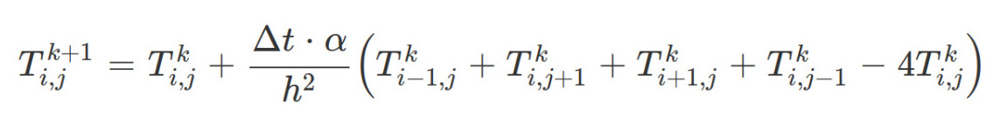
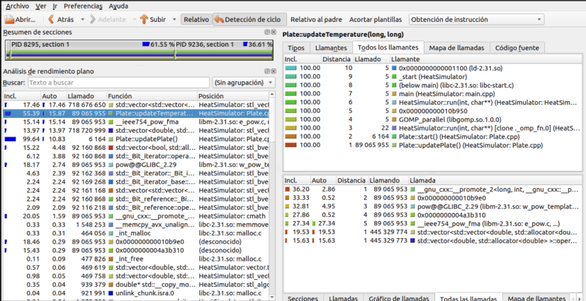
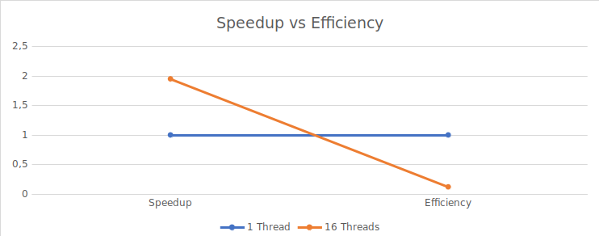

# **Heat Simulator 1.1**

## Descripción del problema

Este programa consiste en una aplicación concurrente, desarrollada en C++, que simula la transferencia de calor a láminas rectángulares a través sus bordes para que estas cambien de estado hasta que encuentren el equilibrio térmico. 

### Análisis del problema

Para este programa se desea crear una matriz, la cual representa la lámina rectangular, cuyas celdas son cuadradas(esto pues son todas del mismo ancho y alto), y a la que se le aplicará una [fórmula](img/Formula_transferencia_de_calor.png) para cambiar su estado hasta que esta encuentre el punto de equilibrio.



Esta matriz almacenará en sus celdas internas distintas temperaturas, las cuales irán cambiando después de cierto tiempo transcurrido. Dichas temperaturas, así como la duración de cada etapa, la difusividad térmica, las dimensiones de las celdas de la matriz y el punto equilibrio que se desea alcanzar, se obtendrán mediante la lectura de un archivo txt el cual contiene un archivo binario con los datos para la lámina(temperaturas iniciales) y los otros cuatro parámetros recién mencionados.

Cuando las láminas estén balanceadas, el programa dentendrá su ejecución y generará un archivo de reporte(de tipo tsv), con los valores de la simulación y un archivo binario con el estado final de la matriz; los cuales se guardarán en la misma carpeta donde se encuentra el archivo de trabajo.

## Manual de uso

### Compilación

Para compilar el código, abra la terminal de su máquina y ejecute el [Makefile](HeatSimulator/Makefile) brindado usando el siguiente comando:

``` text
make 
```

Este comando generará una carpeta **bin** en la cual se guardará el archivo **HeatSimulator.o**.

### Ejecución

Para la ejecución del programa es necesario un solo parámetro, este es el archivo de texto del cuál se extraerá la información necesaria para la simulación. Sin embargo, puede pasar un segundo parámetro opcional, que corresponde a la cantidad de hilos de ejecución. En caso de omitirlo, el programa supondrá que desea utilizar tantos hilos como CPUs hay disponibles en el sistema.

Por lo tanto, en el caso de que desee correr la aplicación con una cantidad de hilos determinada, se debe hacer de la siguiente manera:

``` text
bin/HeatSimulator jobs/job002/job002.txt 8
```

En este ejemplo, la simulación leerá el job002.txt que se encuentra en la carpeta de jobs y utilizará 8 hilos de ejecución específicamente.


Para detener la ejecución, utilice la combinación de teclas:
``` text
Ctrl+C
```

Una vez finalizado el programa, se recomienda hacer ``` make clean``` para eliminar los archivos que ya no son necesarios y así compilar exitosamente en una futura ejecución.

## Programa de pruebas

Además del programa principal para la simulación de calor, se provee un programa adicional([BinaryComparator](BinaryComparator)) para la comparación de dos archivos binarios de lámina. Este recibe 3 parámetros distintos, los primeros dos son los archivos que se desean comparar y el tercero es el valor epsilon dado para estas láminas.

## Compilación y ejecución del programa de pruebas

Para compilar el código, utilice el comando:
``` text
make 
```
Luego, ejecute el programa ingresando los 3 argumentos necesarios, de la siguiente manera:

``` text
bin/BinaryComparator ../HeatSimulator/jobs/job00x/plate00x-x.bin ../HeatSimulator/jobs/job00x/plate00x-xtest.bin epsilon
```
De esta manera, se compararán las matrices de ambos archivos binarios, comparando primero las dimensiones y luego las temperaturas de cada pareja de celdas con el valor epsilon dado. Esto se hace para evitar problemas de precisión que presenta la artimética flotante.

A continuación, se provee un ejemplo de cómo se vería la ejecución de este programa tanto en el caso de que ambos archivos sean iguales como en el caso de que sean diferentes:
  
  Caso 1. Ambos archivos son iguales:
      
      Entrada: 

      bin/BinaryComparator ../HeatSimulator/jobs/job001/plate001-2.bin ../HeatSimulator/jobs/job001/plate001-2.bin 2

      
      Salida:
      
        The dimensions are the same
        The temperatures in both plates are the same

       
       
  Caso 2. Ambos archivos son diferentes:
   
      Entrada: 
 
      bin/BinaryComparator ../HeatSimulator/jobs/job001/plate001-2.bin ../HeatSimulator/jobs/job001/plate002.bin 2
      
      Salida:

        The dimensions are different
       
      
## Análisis de rendimiento

Con este análisis de rendimiento se pretende demostrar el incremento de velocidad y eficiencia que obtuvo el algoritmo al aplicar la tecnología de paralelización de datos, OpenMP. Por lo que, en primera instancia, se probará la rapidez con la que el programa serial es capaz de ejecutar el código, para luego ser sometido a un análisis dinámico y finalmente, ser comparado con la versión parelizada. 

Para este análisis, ambos programas fueron ejecutados tres veces en el laboratorio 02, el cual cuenta con 16 CPUs disponibles; además se utilizó el job00"X".txt, que contiene "X" láminas y "Y" casos distintos para la simulación de calor, por lo que es un caso de prueba mediano.


1. Rendimiento del código serial

Con esta versión se obtuvieron tres distintas duraciones: "7489.22", "7437.54" y "7442.84", en ese orden. Para efectos de la comparación a realizar más adelante, se tomará la duración con el menor tiempo, que sería "7437.54".

2. Profiling

Al realizar el profiling utilizando la herramienta Callgrind y el job001.txt, se obtuvo que la sección de código que tuvo un mayor consumo de CPU fue ```updateTemperature()```, lo que la hace candidata a ser paralelizada. 



3. Rendimiento del código paralelo

En esta versión, se obtuvieron los tiempos: "3955.23", "3840.89" y "3821.97". Al igual que en la **sección 1**, se tomará el menor de estos para la comparación, el cual fue "3821.97".

4. Gráfico





1. Conclusiones

Como se puede observar en la **sección 4** de este apartado, la versión paralela del programa tuvo un incremento de velocidad(_speedup_), de "1.95" y una eficiencia de "0.12", además de una duración de "3821.97", la cual supera a los "7437.54" obtenidos con el programa serial. Por lo tanto, queda demostrado que al paralelizar el código, este ha obtenido un aumento del rendimiento considerable.

## Créditos

Proyecto desarrollado por:

* Esteban Castañeda Blanco, correo: esteban.castaneda@ucr.ac.cr
* Daniel Lizano Morales, correo: daniel.lizanomorales@ucr.ac.cr
* Andrea Ramírez Rojas, correo: andrea.ramirezrojas@ucr.ac.cr
* Carlos Ramírez Masís, correo: carlos.ramirezmasis@ucr.ac.cr
