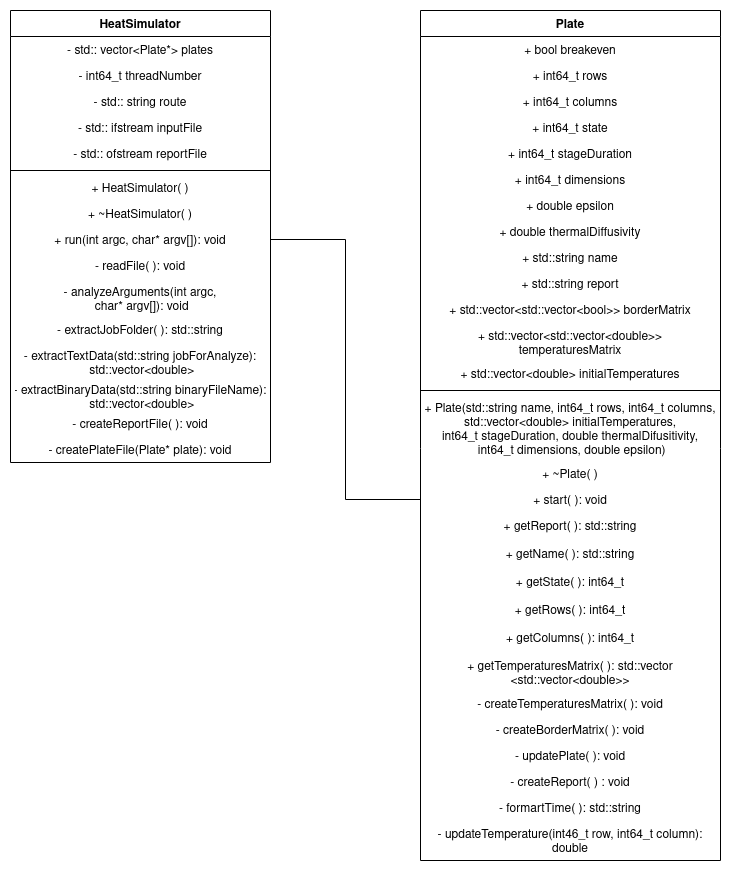

# **Heat Simulator 1.2**

## Descripción del problema

Para esta primera parte del proyecto, corresponde hacer una aplicación concurrente, que lee archivos dados mediante la entrada estándar y que, a partir de estos, simula la transferencia de calor a láminas rectangulares a través sus bordes para que estas cambien de estado hasta que encuentren el equilibrio térmico y genera archivos de reporte con los resultados obtenidos. Para esto, el programa se dividirá en 3 partes principales:

* ```Main```: hace llamado al método constructor de la clase que resuelve el problema.

* ```Plate```: contiene los métodos para generar una lámina y hacer el cálculo de la transferencia de calor.

* ```HeatSimulator```: contiene los métodos para el manejo de los archivos recibidos, generar el reporte, además de hacer el llamado a los métodos que se encargan de la simulación. 

## Análisis de las clases UML



### Plate

La clase plate se encarga de todo lo relacionado al manejo de las matrices. Crea y actualiza los valores de las láminas, hace el cálculo de la transferencia de calor y crea una hilera con el nombre de la lámina, el estado en el que alcanzó el punto de equilibrio y tiempo que duró haciendo el cálculo, que servirá para generar el reporte. 

### HeatSimulator

El HeatSimulator se encarga de todo lo relacionado al manejo y lectura de los archivos que se proveen en la entrada estándar, la extracción de los valores necesarios para la simulación, el llamado a las subrutinas encargadas de los cálculos que determinan cuando una lámina llegó al equilibrio térmico y de generar los archivos de reporte.


## Créditos

Proyecto desarrollado por:

* Esteban Castañeda Blanco, correo: esteban.castaneda@ucr.ac.cr
* Daniel Lizano Morales, correo: daniel.lizanomorales@ucr.ac.cr
* Andrea Ramírez Rojas, correo: andrea.ramirezrojas@ucr.ac.cr
* Carlos Ramírez Masís, correo: carlos.ramirezmasis@ucr.ac.cr
